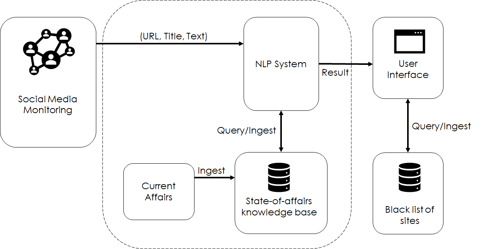

# State-of-the-art Detection Proposal

## Introduction

Based on the results of the quick prototype and proof of concept, hereby is presented a proposal to reach
state-of-the-art (SOTA) results on the task of classifiying news articles as either real or fake (emcompassing
the purpose of such news as disinform, misinform, or entertain) on near or real-time fashion in order to detect
disinformation campaigns at scale.

The results of the prototype showed that it is possible to achieve higher-than-chance results on this task (the
current result on the prototype is of 88.35% accuracy on the test set) using SOTA language models based on the
Transformer architecture. In said prototype, `distilBERT` is used and trained with ~1600 news titles (half on
each class) and evaluated with ~400 news titles.

Since the veracity of a news text depends on real word knowledge, the system has to leverage on a knowledge base
that contains facts on a given topic or set of topics. The scope of the system thus cannot be a "Universal" fake
news detector. However, the early results of the prototype show that there are linguistics differences being picked
up by the language model on the two kinds of texts collected on the corpus.

So the present solution proposes an ensamble method that takes into consideration:
	
* The news site where the text was taken from
* Linguistic properties (as picked up by the language model)
* Factualness 

## Proposal

The technical requirements driving this proposal comprise near to real-time detection of
disinformation/misinformation/mal-information campaigns. In order to achieve that, it is necessary to monitor
social media for highly-shared links to news media. Different social media platforms achieve different spreading
rates. By far, Twitter seems to be the quickest media for sharing current events. However, Facebook lends itself
to be a means of having news periodically reappearing to the users. In addition, the demogrpahics for both platforms
are different. The last point has to be factored in as well since the campaigns could be targeted to specific demographics.

The scope of this proposal is only the natural language processing (NLP) segment of a more comprehensive solution. Another part
of the solution has to monitor social media and be able to detect when a news story is spreading in the network
of users and to identify what are the subnetworks of users being targeted. Once a news story is identified as potentially
being part of a targeted campaign due to its spreading rate or "virality", the tuple (URL, Title, Text) is fed into
the NLP classification system (see Figure 1).

The NLP system would then classify the news segment whether as real or fake based on a weighted result out of three
approaches:

1. A classification of the news site source of the text as either credible or not based on a trained classifier with
character *n*-grams of the URL.
1. The linguistic properties of the title and the text as picked up by a SOTA language model (a sort of sentiment analysis).
1. The factualness of the news story. Based on the content of the news, the system would query a knowledge base of current
state-of-affairs, which has to be regularly maintained.

Once the system has a result, it is displayed to a user, who would validate the result with the help of a database of
black-listed websites known to spread fake news. If the web site is not already on the database and the news is determined
to be faked, then the site will be added to the database.

### News site classification

This part of the system would rely on the assumption that there is a pattern to be learned by a machine learning algorithm
in the name and URL of the sites where the news are published and the quality of being real or fake. In order to train
this classifier, a more varied set of real stories must be collected. Currently, the data set contains only 16 credible
web sites and 404 identified non-credible sites. The aim should be to have a balanced data set regarding the sources
of the news.

 
### Title and Text Classification Using SOTA Language Models

This part has been shown in the prototype to be a promising one. Currently, the results presented took only into consideration
the title of the news. It remains to test teh impact of using the actual news text. Even if there are not as good results,
hyperparameter tuning ight help boost the performance. Also, it remains to test other models such as the complete BERT or RoBERTa.
 

### Factualness of the Story

This approach would be the hardest and most critical regarding fake news detection. Leveraging results on Question Answering
tasks, we could frame the corroboration of a news article as a query to a knowledge base. For example, if a news headline
reads *Recently developed vaccine causes autism*, we could query the knowledge base with the question *Does vaccines cause autism?*.
The knowledge base would have to be mantained regularly with recent state of affairs (see Figure 1) due to the very nature
of disinformation campaigns.

## Maintainability

Since the state of affairs by definition are ever changing, the topics relevant and vulnerable to the population would
need to be constantly maintained. This is part of the Social Media Monitoring segment on the proposal as well as the
current affairs being fed into the knowledge base and lastly the data base with black-listed websites.

Once an URL-Title-Text tuple is validated by a user (Human-in-the-loop requirement) as either real or fake, there is no reason
to discard it. The system can use on a weekly or biweekly basis those news to be fine-tuned again on both classifiers: the URL
classifier and the classifier using SOTA language models.

## Ship to Production

The system segment in charge of the monitoring of social media would make a POST request to the NLP system deployed as
a web app, which in turn would query the classifiers and the knowledge base in order to get a response which can be
sent to the user to validate.